# Distributed Reference Execution Architecture (MEGB-03H.2C.3A)

**Status: design specification only. No implementation, no cloud access,
no authentication.** Authorized by the "Approved MEGB-03H.2C.3 Planning
Amendment" (`tickets/megb-03.md`), following MEGB-03H.2C.2B's
`BLOCKED_TELEMETRY_OVERHEAD` finding: the local Docker Desktop path
cannot support the remaining calibration/experimental workload (exact
cgroup telemetry unavailable, sampled-fallback overhead 70–130× the
frozen gate). This document specifies the replacement — a native-Linux,
horizontally distributed execution environment — at the provider-neutral
application boundary first, then maps it onto the proposed Google Cloud
Platform (GCP) implementation.

**Corrected after initial review** (this checkpoint remains
documentation/ticket-only; no GCP access occurred in producing the
correction): the original version of this document did not cleanly
separate *candidate generation* (a managed-model call) from *candidate
execution* (untrusted code running inside the MEGB-02 Docker boundary).
That absence created an unnecessary trust-boundary problem — nothing
architecturally prevented a worker that executes untrusted candidate
code from also holding managed-model credentials or Vertex invocation
permission. §2 below defines two explicitly separate planes with
non-transitive permissions, connected only through immutable,
checksummed candidate manifests — reflected throughout §3–§7. See §8 for
the qualification-wording correction (Compute Engine MIG is the
approved *initial implementation baseline*, not yet a *scientifically
qualified* substrate).

This is a new top-level `docs/architecture/` directory (the repository
previously had no dedicated architecture-documentation location;
`docs/reference/reference-evaluation-architecture.md` covers the
single-host reference-evaluation design). Placing this document there
follows the same naming/structure convention as `docs/security/`,
`docs/operations/`, and `docs/measurement/` — a topic-scoped directory
under `docs/`, not a deviation from an existing convention so much as an
extension of the established pattern to a topic this repository has not
previously needed.

## 1. Why provider-neutral first

Every accepted requirement in this project's scientific schemas
(`src/reference/result_schema.py`, `cache_key.py`, `calibration_schema.py`)
is provider-independent by design — a cache key, a `ReferenceTaskResult`,
or a `CalibrationInvocationRecord` means the same thing whether it was
produced on a laptop, an AWS instance, or a GCP VM. The "Approved
MEGB-03H.2C.3 Planning Amendment" is explicit that selecting GCP "must
not embed GCP-specific concepts into scientific result, cache-key,
evaluator, or calibration schemas unless independently justified." This
document therefore separates two layers everywhere:

- **Abstractions** (§3) — what the distributed system must do, stated
  without naming any cloud product.
- **GCP mapping** (§4) — which GCP product currently implements each
  abstraction, in this proposal only.

A future provider change (or a native-Linux non-cloud fleet) should be
able to replace §4 without touching §3, the scientific schemas, or any
already-accepted evaluator/execution code.

## 2. Two planes, separated by trust and permission — not merely by role

**Correction**: candidate *generation* (a call to a managed model) and
candidate *execution* (running untrusted code through the MEGB-02 Docker
boundary) are two architecturally separate planes, each with its own
service identity, its own Pub/Sub topics, and its own Cloud Storage
namespace. They are never the same trusted context, and no single
identity holds both a Vertex invocation role and Docker-host/privileged-
reference access. This is the load-bearing correction the rest of this
document builds on.

### 2.1 Reference-execution plane

- Runs untrusted candidate code through the unchanged MEGB-02 Docker
  boundary (per-invocation container, no network, no mounts, dropped
  capabilities).
- May access only the work items and privileged reference material
  required for its assigned evaluation (canonical solutions, oracle
  records, reference cases) — the same privileged-access scope this
  project already enforces locally, now under GCP IAM instead of local
  filesystem permissions.
- **Has no Vertex/model-invocation role or credentials, under any
  circumstance.**
- Has no authority to generate new candidates.
- Cannot publish arbitrary candidate portfolios or alter candidate-
  selection provenance — it consumes an already-immutable candidate
  manifest, it does not produce or edit one.

### 2.2 Candidate-generation plane

- Uses a separate service identity and separate queue/storage
  namespaces from the reference-execution plane.
- May invoke the approved managed-model endpoint **only after
  MEGB-03H.2C.3G freezes the model portfolio** — not before, and this
  document does not itself authorize any such call.
- **Never executes candidate code** — it calls a managed model and
  persists the model's own textual output as a candidate artifact; it
  has no Docker access, no execution runtime for candidate code at all.
- Has no access to privileged reference evidence, reference oracles,
  production reference caches, or calibration artifacts — generating a
  candidate requires only the task's own public specification (entry
  point, signature, docstring — the non-privileged view
  `src/dataset.py` already exposes), never the hidden tests or
  canonical solution.
- Produces immutable, checksummed candidate artifacts and provenance
  records for later consumption by the reference-execution plane.

### 2.3 How the planes connect

**Only** through immutable, checksummed candidate manifests — a
generation-plane output, written once, never mutated, read (never
written) by the execution plane. No other channel exists between the
two planes. In particular, and non-negotiably:

- **The execution-worker service account must never receive Vertex
  model-invoker permission** — not a broader role that happens to
  include it, not a temporary grant, never.
- **The generation service account must never receive access to
  privileged oracle/reference artifacts or the Docker execution host** —
  it cannot read canonical solutions, hidden tests, or the reference
  cache, and it cannot reach a worker VM's Docker daemon.
- **Pub/Sub messages carry opaque work references and allowlisted
  routing metadata only** — never privileged evidence, unrestricted
  candidate source, credentials, or free-form diagnostic text. A
  reference-execution work item names *which* candidate manifest entry
  to execute (an opaque, checksummed reference), not the candidate
  source inline.
- **Model-cost amplification after an execution-worker compromise must
  be structurally impossible, not merely monitored.** Because the
  execution-worker service account holds no Vertex permission at all, a
  fully compromised execution worker (the adversarial-candidate-code
  threat model MEGB-02 already assumes, per `execution-threat-model.md`)
  has no credential path to Vertex whatsoever — there is no monitored
  limit to bypass, because there is no permission to bypass. This is a
  structural property of the IAM design, not a runtime control that
  could fail open.

## 3. Provider-neutral abstractions

| Abstraction | Plane | Responsibility | Existing MEGB precedent it extends |
|---|---|---|---|
| **Work admission and leasing** | Both (separate queues per plane) | Hands one unit of work to exactly one worker/generator at a time, with a bounded lease reclaimable if the consumer disappears. | `src/reference/reference_orchestrator.py`'s `WorkItem` model — currently in-process; this abstraction is the distributed generalization, instantiated once per plane. |
| **Worker-fleet control** | Reference-execution only | Starts, scales, and tears down Docker-capable worker instances; replaces a worker that disappears mid-lease. | None today (single local process). New. |
| **Object/artifact persistence** | Both (separate namespaces per plane) | Durable storage for run manifests, checkpoints, safe reports, and (separately, see below) protected/privileged persistence. | `src/reference/reference_cache.py`'s on-disk `ReferenceResultCache`; `src/reference/h5_staging.py`'s staging cache — both local-filesystem today. |
| **Audit and trace persistence** | Reference-execution only (the concept this project's calibration/audit schemas already model) | The durable, append-only, checksum-verified record of every invocation attempt, independent of whether its result was cached. | `src/reference/calibration_trace.py` (`CalibrationTraceStore`), `src/reference/reference_audit.py` — both local-filesystem JSONL today. |
| **Container-image resolution and provenance** | Reference-execution only | Resolves a pinned, content-addressed runner image before any invocation, and records that identity on every result. | `docker/runner/compute_provenance.sh`, `CandidateExecutionResult.runner_image_digest` — already provider-independent; a worker just needs a way to pull the same pinned image. |
| **Candidate-generation backend** | Candidate-generation only | Produces candidate source from a model, under a frozen, versioned request/response contract, writing immutable candidate manifests for the execution plane to consume. | Not yet built in this repository; MEGB-03H.2C.3G's own scope for the model-portfolio freeze; the generation-plane *schema boundary* is reserved now (§7 of the provenance audit). |
| **Cost estimation and authorization** | Both (Vertex cost tracked and bounded in the generation plane only; compute cost in the execution plane) | Computes an estimated cost for a proposed run before it starts, and refuses to start above the run's own authorized ceiling. | New. Directly required by the "Approved MEGB-03H.2C.3 Planning Amendment" §5 (cost controls). |
| **Environment identity** | Both | An explicit, verifiable, typed identity distinguishing which environment (personal bootstrap vs. company playground) and which distributed-execution provenance context produced a given run, artifact, or record. | New. See `docs/reference/megb-03h2c3a-gcp-provenance-audit.md` (now gating H.2C.3D, not only H.2C.3F). |
| **Run submission, cancellation, resumption, and reconciliation** | Reference-execution only | Starts a run, allows cooperative cancellation, resumes an interrupted run without duplicating or losing scientific coordinates, and reconciles trace/cache/audit records against each other afterward. | `src/reference/reference_orchestrator.py`'s existing `CachePolicy`/replicate-admission/reconciliation logic (`reconcile_task_evaluation`) — already designed for exactly this at single-process scale; the distributed layer must preserve, not replace, these invariants. |
| **Safe summary/report generation** | Both (separate reports; never merged in a way that lets generation-plane content leak execution-plane privileged access, or vice versa) | Produces a self-checksummed, explicitly allowlisted report from a run, excluding candidate source, raw I/O, and any privileged/identifying content. | `g4_qualification_report.py`, `h2c2b_qualification_report.py`, `CalibrationSummaryReport` — direct precedent this design reuses without modification. |

## 4. Proposed GCP mapping (not yet implemented)

| Abstraction | Plane | GCP implementation |
|---|---|---|
| Work admission and leasing | Reference-execution | **Pub/Sub** — a dedicated topic/subscription set, ack-deadline as the lease, dead-letter topic for poison messages. |
| Work admission and leasing | Candidate-generation | A **separate** Pub/Sub topic/subscription set — never shared with the execution plane's queue. |
| Worker-fleet control | Reference-execution | **Managed Instance Group (MIG)** on **Compute Engine**, native-Linux x86 workers. See §5 for why this, not GKE/Cloud Run/Cloud Batch, is the initial implementation baseline. |
| Object/artifact persistence | Reference-execution | **Cloud Storage** — a bucket (or prefix set) dedicated to the execution plane per environment, with a distinct, access-controlled prefix for protected/privileged persistence (see `docs/measurement/privileged-artifact-policy.md`'s existing local-filesystem equivalent). The generation plane has **no read or write access** to this namespace. |
| Object/artifact persistence | Candidate-generation | A **separate** Cloud Storage bucket/prefix set, holding only immutable candidate manifests and generation-provenance records. The execution plane has **read-only** access to this namespace (to consume manifests), never write access. |
| Audit and trace persistence | Reference-execution | **Cloud Storage**, append-only object naming (mirroring `CalibrationTraceStore`'s own append-only-JSONL-plus-checksum design) or Cloud Storage plus a small coordinator-local durable log, finalized to Storage — exact durability mechanism is an H.2C.3B.2 interface-design decision, not frozen here. |
| Container-image resolution and provenance | Reference-execution | **Artifact Registry**, pinned by digest (never by mutable tag) — the same content-addressing discipline `compute_provenance.sh` already enforces locally. |
| Candidate-generation backend | Candidate-generation | **Vertex AI Model Garden / Model-as-a-Service (MaaS)** — reachable **only** from the generation plane's own coordinator/service identity, never from a reference-execution worker. |
| Cost estimation and authorization | Both | Generation-plane logic parameterized against Vertex pricing; execution-plane logic parameterized against Compute Engine/Storage/Pub-Sub pricing — see `docs/measurement/gcp-experiment-cost-model.md`. Because the two cost sources are already isolated by the plane separation itself, a compromised execution worker cannot inflate Vertex spend (§2.3). |
| Environment identity | Both | A coordinator-issued, non-secret, typed identity recorded in every run manifest and safe report on both planes — backed by (but never equal to) the GCP project number, per the provenance audit's "safe audit-only metadata"/"safe logical identifier" classification (H.2C.3B.1's own scope to design, versioned and content-bound, not this document's). |
| Run submission/cancellation/resumption/reconciliation | Reference-execution | Execution-plane coordinator process driving the same `CachePolicy`/reconciliation logic already accepted in `reference_orchestrator.py`, extended to a distributed work source. |
| Safe summary/report generation | Both | Unchanged pattern; reused directly, per-plane. |
| Worker compute | Reference-execution | **Compute Engine** native-Linux x86 VMs, primarily **Spot**, with a small **On-Demand** fallback pool for lease-critical or Spot-unavailable capacity. |
| Logging/monitoring | Both | **Cloud Logging** and **Cloud Monitoring**, restricted to strict, explicit safe-field allowlists — the same discipline `CalibrationSummaryReport`/`H2C2BQualificationReport` already apply to committed artifacts, extended to operational logs. Execution-plane and generation-plane logs are logically separated (distinct log names/sinks), never merged. |
| Secrets/credentials | Both | **Secret Manager** plus attached VM/service-account identities — never a long-lived downloaded key (see `docs/operations/gcp-environment-promotion.md` §4). Execution-plane and generation-plane service accounts are distinct principals with disjoint role sets (§2.3). |
| Infrastructure definition | Both | **Terraform/OpenTofu**, one module tree with explicitly separate execution-plane and generation-plane modules/variable groups, two environments (personal/company) deployed from the same source with different variable sets — never divergent copies. |

## 5. Substrate choice: why Compute Engine, not Cloud Run/GKE/Cloud Batch

The initial **implementation baseline** — not yet a scientifically
qualified execution substrate, see §8 — is an **ordinary native-Linux
Compute Engine worker running the existing, unmodified MEGB-02 Docker
isolation boundary**, for the reference-execution plane only — not
Cloud Run, GKE, or containerized Cloud Batch. Reason:
MEGB-02's entire design (`docs/security/execution-sandbox.md`,
`execution-threat-model.md`) assumes the trusted controller has direct,
unmediated access to a real Docker daemon for `docker run`/`docker
inspect`/`docker rm`, and MEGB-03H.2C.2A/2B's own corrected terminal-state
predicate depends on `docker inspect`'s `State.Running`/`State.Status`/
`State.FinishedAt` fields reflecting a *real* container lifecycle on a
*real* Linux cgroup v2 hierarchy the controller can eventually read.
Running MEGB-02's own container-per-invocation model *nested inside*
another container-orchestration layer (GKE pods, Cloud Run's own
sandboxed runtime, or Cloud Batch's managed container execution) would
require nested containerization, Docker-daemon access from inside an
already-sandboxed environment, and would put the cgroup identity and
post-terminal-read guarantees this project spent two full checkpoints
(H.2C.2A, H.2C.2A's terminal-state-proof audit) establishing back into
an unverified state. A plain Compute Engine VM — Linux, a real kernel, a
real Docker daemon the coordinator/worker process on that VM controls
directly — is the smallest change from the already-validated local
design. Cloud Run/GKE/containerized Cloud Batch remain available as a
**future, separately authorized** substrate only if a later checkpoint
proves nested isolation, Docker-daemon access, cgroup identity, and
post-terminal telemetry all remain correct under one of them.

## 6. Trust-boundary and component diagram

```mermaid
flowchart TB
    subgraph Human["Human / Developer"]
        Dev[Developer workstation]
    end

    subgraph GenPlane["CANDIDATE-GENERATION PLANE (own service identity, own queue/storage)"]
        direction TB
        GenCoord[Generation coordinator<br/>generation service account]
        GenPubSub[(Pub/Sub -- generation queue<br/>SEPARATE from execution queue)]
        GenGCS[(Cloud Storage -- generation bucket<br/>immutable candidate manifests + provenance<br/>NO privileged reference content)]
        Vertex[Vertex AI Model Garden / MaaS]
        GenCoord -->|publish/lease| GenPubSub
        GenCoord -->|"invoke ONLY after<br/>H.2C.3G model-portfolio freeze"| Vertex
        GenCoord -->|write immutable,<br/>checksummed manifest| GenGCS
    end

    subgraph ExecPlane["REFERENCE-EXECUTION PLANE (own service identity, own queue/storage)"]
        direction TB
        ExecCoord[Execution coordinator<br/>NO Vertex permission]
        ExecPubSub[(Pub/Sub -- execution queue<br/>opaque work refs + allowlisted<br/>routing metadata only)]
        ExecGCS[(Cloud Storage -- execution bucket<br/>trace / audit / privileged prefix<br/>NO Vertex-plane access)]
        AR[(Artifact Registry -- pinned runner image)]
        subgraph WorkerFleet["Worker fleet (Compute Engine MIG, native Linux)"]
            direction TB
            subgraph Worker1["Worker VM (trusted, execution-worker SA:<br/>NO Vertex role, ever)"]
                WorkerProc1[Worker process /<br/>docker_backend.py]
                Docker1[Docker daemon]
                subgraph Cand1["Untrusted candidate container<br/>(MEGB-02 isolation, unchanged)"]
                    Cand1Code[Candidate code]
                end
            end
            subgraph WorkerN["Worker VM N (trusted, same SA restriction)"]
                WorkerProcN[Worker process]
                DockerN[Docker daemon]
                subgraph CandN["Untrusted candidate container"]
                    CandNCode[Candidate code]
                end
            end
        end
        ExecCoord -->|publish work items<br/>opaque manifest-entry refs| ExecPubSub
        ExecPubSub -->|lease / ack| WorkerProc1
        ExecPubSub -->|lease / ack| WorkerProcN
        WorkerProc1 -->|pull pinned digest| AR
        WorkerProcN -->|pull pinned digest| AR
        WorkerProc1 -->|"docker run / inspect / rm<br/>(host-side only, no docker exec into candidate)"| Docker1
        Docker1 -->|per-invocation container,<br/>no network, no mounts| Cand1
        WorkerProcN --> DockerN
        DockerN --> CandN
        WorkerProc1 -->|write trace / results| ExecGCS
        WorkerProcN -->|write trace / results| ExecGCS
        ExecCoord -->|read manifests, reconcile| ExecGCS
    end

    subgraph Shared["Shared, bounded-scope services"]
        SM[(Secret Manager -- distinct secrets<br/>per plane, no cross-plane access)]
        Logging[(Cloud Logging / Monitoring<br/>safe-allowlist only, logs<br/>logically separated per plane)]
    end

    Dev -->|"IaC apply, run submission<br/>(no direct worker access)"| GenCoord
    Dev -->|"IaC apply, run submission<br/>(no direct worker access)"| ExecCoord
    ExecCoord -.->|"read-only: consume the<br/>immutable candidate manifest<br/>(the ONLY cross-plane channel)"| GenGCS
    GenCoord -->|attached SA, no long-lived keys| SM
    ExecCoord -->|attached SA, no long-lived keys| SM
    GenCoord -.->|bounded safe fields only| Logging
    ExecCoord -.->|bounded safe fields only| Logging
    WorkerProc1 -.->|bounded safe fields only| Logging
    WorkerProcN -.->|bounded safe fields only| Logging

    Cand1Code -.->|"BLOCKED: no network,<br/>no docker socket,<br/>no metadata-server route,<br/>no Vertex credential to steal"| Docker1
    CandNCode -.->|BLOCKED| DockerN

    classDef trusted fill:#1a3a1a,stroke:#3a6a3a,color:#e0ffe0;
    classDef untrusted fill:#3a1a1a,stroke:#6a3a3a,color:#ffe0e0;
    classDef external fill:#1a1a3a,stroke:#3a3a6a,color:#e0e0ff;
    classDef genplane fill:#3a2a1a,stroke:#6a4a2a,color:#ffe8d0;
    class ExecCoord,WorkerProc1,WorkerProcN,Docker1,DockerN trusted;
    class Cand1,CandN,Cand1Code,CandNCode untrusted;
    class Vertex,Human,Dev external;
    class GenCoord,GenPubSub,GenGCS genplane;
```

**No edge in this diagram connects a worker VM (or the execution
coordinator) to Vertex.** The only edge crossing from the execution
plane into the generation plane's namespace is a **read-only** manifest
consumption (`ExecCoord -.-> GenGCS`); nothing flows the other way, and
nothing in the generation plane ever touches `ExecGCS`, `AR`, or a
worker's Docker daemon. The single hard trust boundary this diagram
preserves, unchanged from MEGB-02, still holds *within* the execution
plane: **trusted controller/worker code (host-side, never executes
candidate source) versus the untrusted candidate container**
(network-isolated, no Docker socket, no host filesystem, no
metadata-server route). Distributing the controller across many worker
VMs multiplies *how many* trusted execution-plane processes exist; it
does not weaken what any one of them is trusted to do, and — per the
plane separation above — it also cannot expand *what a compromised one
of them could reach*, since Vertex access was never granted to that
plane's identity in the first place.

## 7. Invariants this architecture must preserve

All of the following are already-accepted, already-tested properties of
the current single-host design. None may regress:

- **MEGB-02 per-invocation Docker isolation** — one fresh container per
  candidate invocation, unchanged flags (`--network none`, read-only
  root filesystem, dropped capabilities, `no-new-privileges`, non-root
  user), per `docker_backend.py`'s existing `_build_docker_run_command`.
- **No candidate network access** — including no route to the GCP VM
  metadata server (`169.254.169.254`), which is the cloud-specific
  instance of the existing `execution-sandbox.md` "cannot access a cloud
  metadata endpoint" test already proven against AWS-style addressing;
  the GCP metadata server uses the identical link-local address and is
  blocked by the identical `--network none` control.
- **No Docker socket or privileged evaluator content inside candidate
  containers** — the worker process, not the candidate, holds the only
  Docker-daemon handle; nothing is ever bind-mounted into a candidate
  container.
- **Trusted controller versus untrusted candidate separation** —
  preserved per-worker; a compromised or buggy worker process still
  cannot let candidate code escape its own container, by the same
  MEGB-02 controls, independent of which worker VM it runs on.
- **Deterministic result ordering** — where the accepted design requires
  it (e.g. `reference_orchestrator.py`'s own ordering guarantees), the
  distributed coordinator must reconstruct or preserve deterministic
  output ordering even though work completes out of order across
  workers.
- **At-least-once delivery with idempotent scientific coordinates** —
  Pub/Sub's own at-least-once semantics mean a work item may be
  delivered and executed more than once; every downstream consumer
  (cache key, calibration trace, audit record) must already tolerate a
  duplicate delivery producing the same scientific coordinate twice
  without corrupting the record — this project's existing content-
  checksum-bound reconciliation (`reconcile_task_evaluation`,
  `CalibrationTaskEvaluationRecord`) is designed for exactly this and
  requires no change.
- **Retry, cancellation, and Spot-preemption recovery** — a Spot
  preemption is, from the scientific-coordinate perspective, just
  another infrastructure-retry cause; it must feed the same retry/
  circuit-breaker machinery (`RETRY_EXHAUSTED`, 3-consecutive-failure
  abort) already accepted for MEGB-03H, not a new, parallel mechanism.
- **Cache, trace, and audit reconciliation** — unchanged; a distributed
  run's trace/cache/audit must reconcile exactly as a single-host run's
  does today.
- **Scale-to-zero** — the worker fleet (and, ideally, the coordinator
  itself between runs) returns to zero running/billed instances once
  the work queue drains, never left running by default.
- **Provider-independent scientific result semantics** — a
  `ReferenceTaskResult`/`CalibrationInvocationRecord` produced by a GCP
  worker is byte-for-byte interpretable the same way as one produced
  locally; only the *how it was produced* provenance differs (see the
  provenance audit).
- **Non-transitive, plane-separated permissions** (added by this
  correction) — the reference-execution plane's service identity never
  holds Vertex/model-invocation permission, under any grant, temporary
  or otherwise; the candidate-generation plane's service identity never
  holds access to privileged reference evidence, reference oracles,
  production reference caches, calibration artifacts, or the Docker
  execution host; the two planes connect only through immutable,
  checksummed candidate manifests (read-only from the execution plane's
  side); and a full compromise of an execution worker (the adversarial-
  candidate-code threat model MEGB-02 already assumes) can never reach
  Vertex, because no credential path to it exists on that plane at all —
  a structural property of the IAM design, not a monitored limit.

## 8. Qualification wording (corrected)

**Compute Engine MIG is the approved *initial implementation baseline*,
not yet a *scientifically qualified* execution substrate.** Earlier
drafting in this document and elsewhere used "qualification target"
loosely enough to blur that distinction — corrected here explicitly:

- Selecting Compute Engine MIG (§5) is an architecture decision: it is
  the substrate this project will *build and test against first*,
  because it is the smallest change from the already-validated local
  MEGB-02 design (direct, unmediated Docker-daemon access, no nested
  containerization).
- **Scientific qualification — the determination that this substrate
  actually delivers correct telemetry, noninterference, deterministic
  ordering, and acceptable overhead — occurs only at MEGB-03H.2C.3D**
  (personal, synthetic, distributed qualification) **and, for the
  company environment specifically, at MEGB-03H.2C.3F** (company-
  playground deployment and native-Linux qualification). Neither has
  run; nothing in this document assumes their outcome.
- **The personal bootstrap environment may validate mechanics,
  recovery, isolation, telemetry availability, and cost behavior** — it
  is a legitimate, real proving ground for *does the distributed
  machinery work at all* (Spot recovery, at-least-once idempotency,
  deterministic ordering, cleanup, cost enforcement). **It must not, by
  itself, be treated as establishing scientific equivalence for the
  company environment** — a different project, different quota/network
  posture, and (per the provenance audit's own environment-identity gap)
  a different logical execution context. A personal-bootstrap
  qualification result is evidence the *mechanism* works; it is not a
  substitute for the company playground's own H.2C.3F qualification run
  against its own real infrastructure.

## 9. Related documents

- `docs/security/gcp-distributed-execution-threat-model.md` — threat/
  control matrix for this architecture, including the plane-separation
  threats this correction added.
- `docs/operations/gcp-environment-promotion.md` — personal-bootstrap/
  company-playground environment specification and the credential/
  permission plan, now split by plane.
- `docs/measurement/gcp-experiment-cost-model.md` — parameterized cost
  model and enforcement design, now reflecting plane-isolated cost
  sources.
- `docs/reference/megb-03h2c3a-gcp-provenance-audit.md` — the mandatory
  provenance/schema-gap audit and this checkpoint's decision register,
  now gating MEGB-03H.2C.3D (not only MEGB-03H.2C.3F) and decomposing
  MEGB-03H.2C.3B into MEGB-03H.2C.3B.1/B.2.
- `tickets/megb-03.md` — the "Approved MEGB-03H.2C.3 Planning Amendment"
  this document implements the specification for.
