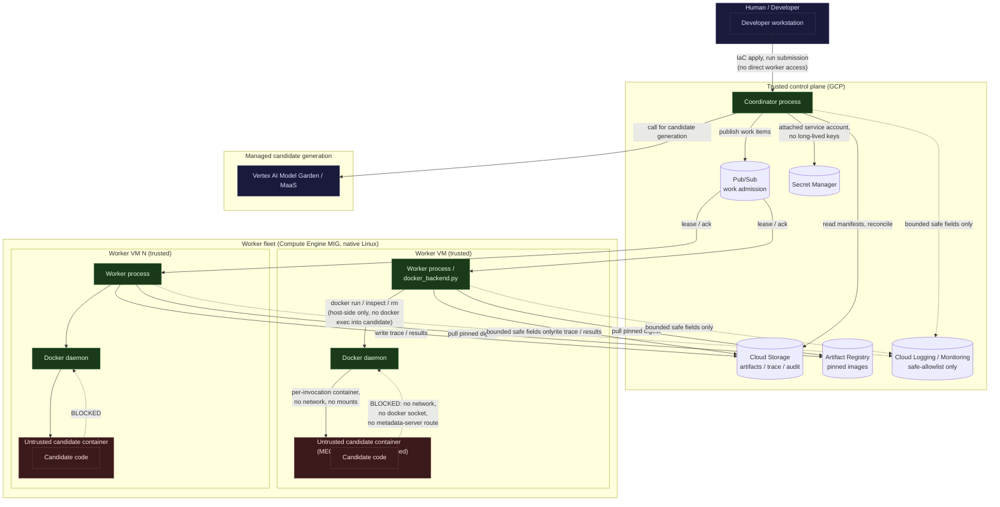

# Distributed Reference Execution Architecture (MEGB-03H.2C.3A)

**Status: design specification only. No implementation, no cloud access,
no authentication.** Authorized by the "Approved MEGB-03H.2C.3 Planning
Amendment" (`tickets/megb-03.md`), following MEGB-03H.2C.2B's
`BLOCKED_TELEMETRY_OVERHEAD` finding: the local Docker Desktop path
cannot support the remaining calibration/experimental workload (exact
cgroup telemetry unavailable, sampled-fallback overhead 70–130× the
frozen gate). This document specifies the replacement — a native-Linux,
horizontally distributed execution environment — at the provider-neutral
application boundary first, then maps it onto the proposed Google Cloud
Platform (GCP) implementation.

This is a new top-level `docs/architecture/` directory (the repository
previously had no dedicated architecture-documentation location;
`docs/reference/reference-evaluation-architecture.md` covers the
single-host reference-evaluation design). Placing this document there
follows the same naming/structure convention as `docs/security/`,
`docs/operations/`, and `docs/measurement/` — a topic-scoped directory
under `docs/`, not a deviation from an existing convention so much as an
extension of the established pattern to a topic this repository has not
previously needed.

## 1. Why provider-neutral first

Every accepted requirement in this project's scientific schemas
(`src/reference/result_schema.py`, `cache_key.py`, `calibration_schema.py`)
is provider-independent by design — a cache key, a `ReferenceTaskResult`,
or a `CalibrationInvocationRecord` means the same thing whether it was
produced on a laptop, an AWS instance, or a GCP VM. The "Approved
MEGB-03H.2C.3 Planning Amendment" is explicit that selecting GCP "must
not embed GCP-specific concepts into scientific result, cache-key,
evaluator, or calibration schemas unless independently justified." This
document therefore separates two layers everywhere:

- **Abstractions** (§2) — what the distributed system must do, stated
  without naming any cloud product.
- **GCP mapping** (§3) — which GCP product currently implements each
  abstraction, in this proposal only.

A future provider change (or a native-Linux non-cloud fleet) should be
able to replace §3 without touching §2, the scientific schemas, or any
already-accepted evaluator/execution code.

## 2. Provider-neutral abstractions

| Abstraction | Responsibility | Existing MEGB precedent it extends |
|---|---|---|
| **Work admission and leasing** | Hands one unit of work (one candidate invocation, or one calibration case) to exactly one worker at a time, with a bounded lease that can be reclaimed if the worker disappears. | `src/reference/reference_orchestrator.py`'s `WorkItem` model — currently in-process; this abstraction is the distributed generalization. |
| **Worker-fleet control** | Starts, scales, and tears down worker instances; replaces a worker that disappears mid-lease. | None today (single local process). New. |
| **Object/artifact persistence** | Durable storage for run manifests, checkpoints, safe reports, and (separately, see below) protected/privileged persistence. | `src/reference/reference_cache.py`'s on-disk `ReferenceResultCache`; `src/reference/h5_staging.py`'s staging cache — both local-filesystem today. |
| **Audit and trace persistence** | The durable, append-only, checksum-verified record of every invocation attempt, independent of whether its result was cached. | `src/reference/calibration_trace.py` (`CalibrationTraceStore`), `src/reference/reference_audit.py` — both local-filesystem JSONL today. |
| **Container-image resolution and provenance** | Resolves a pinned, content-addressed runner image before any invocation, and records that identity on every result. | `docker/runner/compute_provenance.sh`, `CandidateExecutionResult.runner_image_digest` — already provider-independent; a worker just needs a way to pull the same pinned image. |
| **Candidate-generation backend** | Produces candidate source from a model, under a frozen, versioned request/response contract. | Not yet built in this repository; MEGB-03H.2C.3G's own scope. |
| **Cost estimation and authorization** | Computes an estimated cost for a proposed run before it starts, and refuses to start above the run's own authorized ceiling. | New. Directly required by the "Approved MEGB-03H.2C.3 Planning Amendment" §5 (cost controls). |
| **Environment identity** | An explicit, verifiable label distinguishing which environment (personal bootstrap vs. company playground) produced a given run, artifact, or record. | New. See `docs/reference/megb-03h2c3a-gcp-provenance-audit.md` for why this is a real, currently-missing gap. |
| **Run submission, cancellation, resumption, and reconciliation** | Starts a run, allows cooperative cancellation, resumes an interrupted run without duplicating or losing scientific coordinates, and reconciles trace/cache/audit records against each other afterward. | `src/reference/reference_orchestrator.py`'s existing `CachePolicy`/replicate-admission/reconciliation logic (`reconcile_task_evaluation`) — already designed for exactly this at single-process scale; the distributed layer must preserve, not replace, these invariants. |
| **Safe summary/report generation** | Produces a self-checksummed, explicitly allowlisted report from a run, excluding candidate source, raw I/O, and any privileged/identifying content. | `g4_qualification_report.py`, `h2c2b_qualification_report.py`, `CalibrationSummaryReport` — direct precedent this design reuses without modification. |

## 3. Proposed GCP mapping (not yet implemented)

| Abstraction | GCP implementation |
|---|---|
| Work admission and leasing | **Pub/Sub** — one subscription per work-item type, ack-deadline as the lease, dead-letter topic for poison messages. |
| Worker-fleet control | **Managed Instance Group (MIG)** on **Compute Engine**, native-Linux x86 workers. See §5 for why this, not GKE/Cloud Run/Cloud Batch, is the initial substrate. |
| Object/artifact persistence | **Cloud Storage** — one bucket (or prefix set) per environment, with a distinct, access-controlled prefix for protected/privileged persistence (see `docs/measurement/privileged-artifact-policy.md`'s existing local-filesystem equivalent). |
| Audit and trace persistence | **Cloud Storage**, append-only object naming (mirroring `CalibrationTraceStore`'s own append-only-JSONL-plus-checksum design) or Cloud Storage plus a small coordinator-local durable log, finalized to Storage — exact durability mechanism is an H.2C.3B interface-design decision, not frozen here. |
| Container-image resolution and provenance | **Artifact Registry**, pinned by digest (never by mutable tag) — the same content-addressing discipline `compute_provenance.sh` already enforces locally. |
| Candidate-generation backend | **Vertex AI Model Garden / Model-as-a-Service (MaaS)**. |
| Cost estimation and authorization | New coordinator-side logic, parameterized against Vertex/Compute Engine/Storage pricing — see `docs/measurement/gcp-experiment-cost-model.md`. |
| Environment identity | A coordinator-issued, non-secret identity string recorded in every run manifest and safe report — backed by (but not equal to) the GCP project number, per the provenance audit's own "safe audit-only metadata" classification. |
| Run submission/cancellation/resumption/reconciliation | Coordinator process (Compute Engine, or a small managed job) driving the same `CachePolicy`/reconciliation logic already accepted in `reference_orchestrator.py`, extended to a distributed work source. |
| Safe summary/report generation | Unchanged pattern; reused directly. |
| Worker compute | **Compute Engine** native-Linux x86 VMs, primarily **Spot**, with a small **On-Demand** fallback pool for lease-critical or Spot-unavailable capacity. |
| Logging/monitoring | **Cloud Logging** and **Cloud Monitoring**, restricted to strict, explicit safe-field allowlists — the same discipline `CalibrationSummaryReport`/`H2C2BQualificationReport` already apply to committed artifacts, extended to operational logs. |
| Secrets/credentials | **Secret Manager** plus attached VM service accounts — never a long-lived downloaded key (see `docs/operations/gcp-environment-promotion.md` §4). |
| Infrastructure definition | **Terraform/OpenTofu**, one module tree, two environments (personal/company) deployed from the same source with different variable sets — never divergent copies. |

## 4. Substrate choice: why Compute Engine, not Cloud Run/GKE/Cloud Batch

The initial qualification target is an **ordinary native-Linux Compute
Engine worker running the existing, unmodified MEGB-02 Docker isolation
boundary** — not Cloud Run, GKE, or containerized Cloud Batch. Reason:
MEGB-02's entire design (`docs/security/execution-sandbox.md`,
`execution-threat-model.md`) assumes the trusted controller has direct,
unmediated access to a real Docker daemon for `docker run`/`docker
inspect`/`docker rm`, and MEGB-03H.2C.2A/2B's own corrected terminal-state
predicate depends on `docker inspect`'s `State.Running`/`State.Status`/
`State.FinishedAt` fields reflecting a *real* container lifecycle on a
*real* Linux cgroup v2 hierarchy the controller can eventually read.
Running MEGB-02's own container-per-invocation model *nested inside*
another container-orchestration layer (GKE pods, Cloud Run's own
sandboxed runtime, or Cloud Batch's managed container execution) would
require nested containerization, Docker-daemon access from inside an
already-sandboxed environment, and would put the cgroup identity and
post-terminal-read guarantees this project spent two full checkpoints
(H.2C.2A, H.2C.2A's terminal-state-proof audit) establishing back into
an unverified state. A plain Compute Engine VM — Linux, a real kernel, a
real Docker daemon the coordinator/worker process on that VM controls
directly — is the smallest change from the already-validated local
design. Cloud Run/GKE/containerized Cloud Batch remain available as a
**future, separately authorized** substrate only if a later checkpoint
proves nested isolation, Docker-daemon access, cgroup identity, and
post-terminal telemetry all remain correct under one of them.

## 5. Trust-boundary and component diagram

The single hard trust boundary this diagram preserves, unchanged from
MEGB-02: **trusted controller/worker code (host-side, never executes
candidate source) versus the untrusted candidate container (network-
isolated, no Docker socket, no host filesystem, no metadata-server
route)**. Distributing the controller across many worker VMs multiplies
*how many* trusted processes exist; it does not weaken what any one of
them is trusted to do, and it does not grant the candidate container any
capability it does not already lack today.

## 6. Invariants this architecture must preserve

All of the following are already-accepted, already-tested properties of
the current single-host design. None may regress:

- **MEGB-02 per-invocation Docker isolation** — one fresh container per
  candidate invocation, unchanged flags (`--network none`, read-only
  root filesystem, dropped capabilities, `no-new-privileges`, non-root
  user), per `docker_backend.py`'s existing `_build_docker_run_command`.
- **No candidate network access** — including no route to the GCP VM
  metadata server (`169.254.169.254`), which is the cloud-specific
  instance of the existing `execution-sandbox.md` "cannot access a cloud
  metadata endpoint" test already proven against AWS-style addressing;
  the GCP metadata server uses the identical link-local address and is
  blocked by the identical `--network none` control.
- **No Docker socket or privileged evaluator content inside candidate
  containers** — the worker process, not the candidate, holds the only
  Docker-daemon handle; nothing is ever bind-mounted into a candidate
  container.
- **Trusted controller versus untrusted candidate separation** —
  preserved per-worker; a compromised or buggy worker process still
  cannot let candidate code escape its own container, by the same
  MEGB-02 controls, independent of which worker VM it runs on.
- **Deterministic result ordering** — where the accepted design requires
  it (e.g. `reference_orchestrator.py`'s own ordering guarantees), the
  distributed coordinator must reconstruct or preserve deterministic
  output ordering even though work completes out of order across
  workers.
- **At-least-once delivery with idempotent scientific coordinates** —
  Pub/Sub's own at-least-once semantics mean a work item may be
  delivered and executed more than once; every downstream consumer
  (cache key, calibration trace, audit record) must already tolerate a
  duplicate delivery producing the same scientific coordinate twice
  without corrupting the record — this project's existing content-
  checksum-bound reconciliation (`reconcile_task_evaluation`,
  `CalibrationTaskEvaluationRecord`) is designed for exactly this and
  requires no change.
- **Retry, cancellation, and Spot-preemption recovery** — a Spot
  preemption is, from the scientific-coordinate perspective, just
  another infrastructure-retry cause; it must feed the same retry/
  circuit-breaker machinery (`RETRY_EXHAUSTED`, 3-consecutive-failure
  abort) already accepted for MEGB-03H, not a new, parallel mechanism.
- **Cache, trace, and audit reconciliation** — unchanged; a distributed
  run's trace/cache/audit must reconcile exactly as a single-host run's
  does today.
- **Scale-to-zero** — the worker fleet (and, ideally, the coordinator
  itself between runs) returns to zero running/billed instances once
  the work queue drains, never left running by default.
- **Provider-independent scientific result semantics** — a
  `ReferenceTaskResult`/`CalibrationInvocationRecord` produced by a GCP
  worker is byte-for-byte interpretable the same way as one produced
  locally; only the *how it was produced* provenance differs (see the
  provenance audit).

## 7. Related documents

- `docs/security/gcp-distributed-execution-threat-model.md` — threat/
  control matrix for this architecture.
- `docs/operations/gcp-environment-promotion.md` — personal-bootstrap/
  company-playground environment specification and the credential/
  permission plan.
- `docs/measurement/gcp-experiment-cost-model.md` — parameterized cost
  model and enforcement design.
- `docs/reference/megb-03h2c3a-gcp-provenance-audit.md` — the mandatory
  provenance/schema-gap audit and this checkpoint's decision register.
- `tickets/megb-03.md` — the "Approved MEGB-03H.2C.3 Planning Amendment"
  this document implements the specification for.
